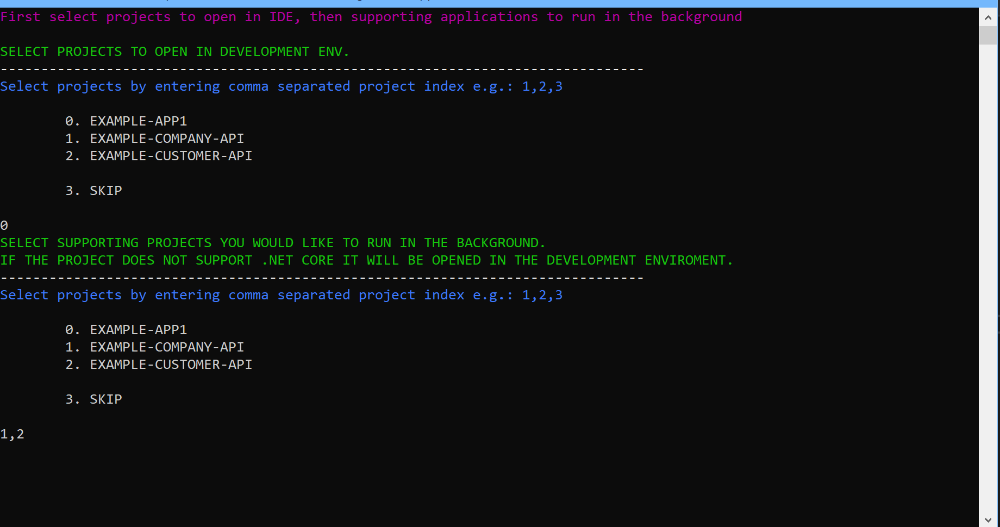

# Dev Launcher

Dev Launcher is a command line tool to help you spool up your microservices for debugging.

## Is Dev Launcher for you?
* Does your application consist of more than one project?
* Is your project written with a microservices architecture?
* You use both .net core and .net full framework?
* Are you starting multiple Visual Studio instances to debug?

If any of the above apply to your projects Dev Launcher can help!

## What does it do?
First you tell Dev Launcher the location of your code projects through configuration. Then you put an icon for Dev Launcher somewhere handy. When you open the tool you'll be able to select which projects to open in your IDE, and which to run in the background. 

You can configure what IDE you'd like to open projects with, but Dev Launcher starts background projects with the dotnet core api. If your project doesn't support .net core, the project will be opened with your configured IDE.

## Installation
Download the .zip file DevLauncher and unzip it to the folder of your choice. Example: C:\Tools\DevLauncher\  

* Add a new file appsettings.Production.json inside the DevLauncher folder
* Copy the text below or from appsettings.json and use that as a starting point. Add all your projects inside the ProjConfigs array


```
{
	"DevEnv": {
        "DevEnvPath": "C:\\Program Files (x86)\\Microsoft Visual Studio\\2019\\Professional\\Common7\\IDE\\devenv",
        "DevEnvParams":  "/command debug.start",
	"UseWindowsTerminal" : true
    },
    "ProjConfigs": [
        {
            "Name": "EXAMPLE-APP1",
            "IsDotNetCore": false,
            "LaunchProfile": "",
            "SolutionPath": "C:\\repos\\ExampleApp1\\source\\ExampleApp.sln",
            "ProjectPath": "C:\\repos\\ExampleApp1\\source\\ExampleApp"
        },
        {
            "Name": "EXAMPLE-COMPANY-API",
            "IsDotNetCore": true,
            "LaunchProfile": "Debug_Launch",
            "SolutionPath": "C:\\repos\\Example.Companies\\source\\Example.Companies.sln",
            "ProjectPath": "C:\\repos\\Example.Companies\\source\\Example.Companies.API"
        }
    ]
}

```

## Usage

Add a link shortcut to Dev Launcher or add it to your path variable. Open Dev Launcher and choose what to launch.

First you'll select the projects that you'd like to use an IDE to debug, then select supporting projects you'd like to run in the background.




## Contributing
Pull requests are welcome. For major changes, please open an issue first to discuss what you would like to change.

## License
[MIT](https://choosealicense.com/licenses/mit/)
